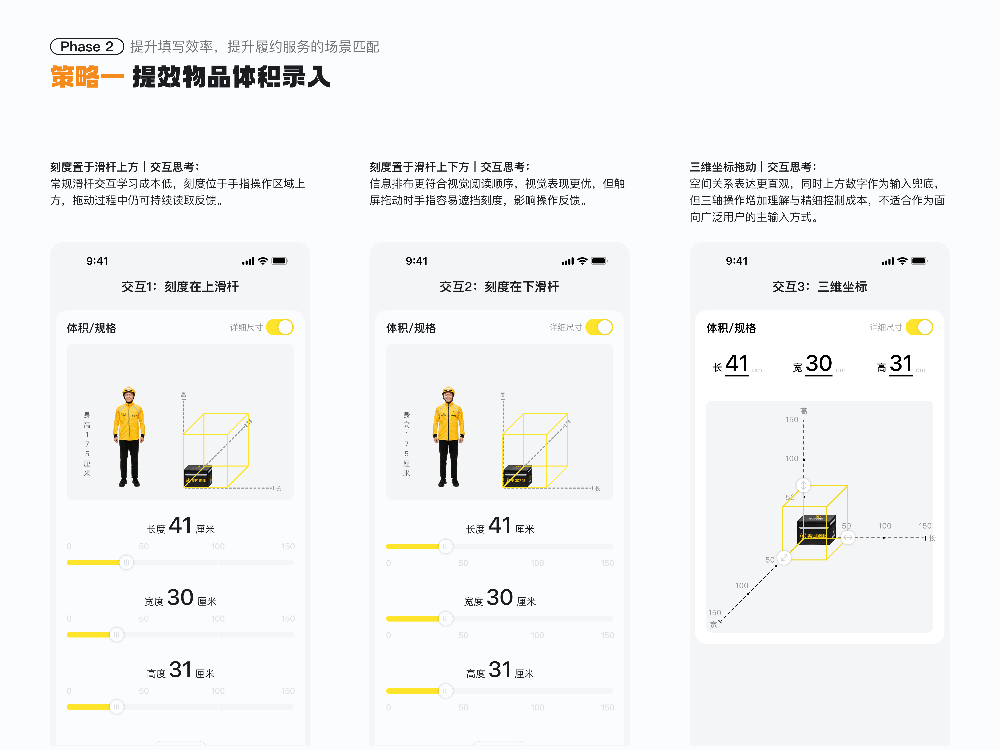

<div align="center">



<p>


</p>

<br />

<a href="https://volume-interaction-lab.pages.dev/"><strong>在线体验三种体积录入方案 →</strong></a>

</div>

## 项目概述

这是一个聚焦跑腿服务中“物品长宽高录入”的高保真交互对比原型。项目在同一订单场景中还原三种尺寸录入方案，用于比较信息阅读顺序、手指遮挡、精细调节效率与空间理解成本。

| 项目属性 | 内容 |
| --- | --- |
| 项目形式 | 物品体积录入的交互方案研究 |
| 原型类型 | 移动端高保真可交互原型 |
| 对比维度 | 阅读顺序、触控遮挡、精细输入、空间映射 |
| 默认尺寸 | 长 41 cm × 宽 30 cm × 高 31 cm，与配送箱参照一致 |

## 三种交互方案

### 1. 刻度在滑杆上方

信息顺序为“数值 → 刻度 → 滑杆”。刻度位于手指操作区域上方，拖动时仍可持续读取反馈。

### 2. 刻度在滑杆下方

信息顺序为“数值 → 滑杆 → 刻度”，更符合视觉阅读顺序，同时用于观察触屏拖动时的刻度遮挡问题。

### 3. 三维坐标拖动

长、宽、高与三条坐标轴一一对应。拖动圆形手柄时，黄色体积框与数值实时联动；也可点击顶部数字区域，使用数字键盘精确输入。

## 交互规则

- 三个方案分别保存自己的长、宽、高，切换方案不会串值。
- 长宽高的有效范围为 `0–150 cm`，高亮框尺寸与输入数值线性对应。
- 任意一条边为 `0 cm` 时，不绘制体积高亮框。
- 默认 `41 × 30 × 31 cm` 时，高亮框与配送箱参照重合。
- 三个方案均支持“恢复默认”，且只重置当前方案。
- 滑杆与三维手柄支持键盘方向键微调；页面空白处可用左右方向键切换方案。
- 右上角“详细尺寸”仅用于展示当前状态，不触发点击效果。

## 原型体验

访问 [volume-interaction-lab.pages.dev](https://volume-interaction-lab.pages.dev/) 即可体验。

- **桌面端**：以 375 × 812 的手机画布展示，视口高度不足时可上下滚动。
- **移动端**：直接拖动滑杆或三维手柄，建议依次尝试三种方案进行对比。
- **说明**：项目仅使用 Mock 数据，不会创建真实订单、支付或传输个人信息。

## 技术实现

| 层级 | 方案 |
| --- | --- |
| 界面框架 | React 19 |
| 开发语言 | TypeScript |
| 构建工具 | Vite 8 |
| 视觉实现 | CSS Custom Properties、SVG |
| 交互输入 | Range Input、Pointer Events、Keyboard Events |
| 在线部署 | Cloudflare Pages |

## 本地运行

环境要求：Node.js 20+、pnpm 10.17.1。

```bash
pnpm install
pnpm dev
```

生产构建：

```bash
pnpm build
```

## 项目声明

本项目为个人自主命题的非商业交互设计研究，与美团官方不存在合作、授权或隶属关系。项目中出现的品牌名称、标识和相关视觉资源仅用于体验分析、设计学习与作品展示。

原型不提供真实跑腿服务，不处理真实订单、支付或个人信息。除法律另有规定外，本仓库目前未授予开源使用许可。
